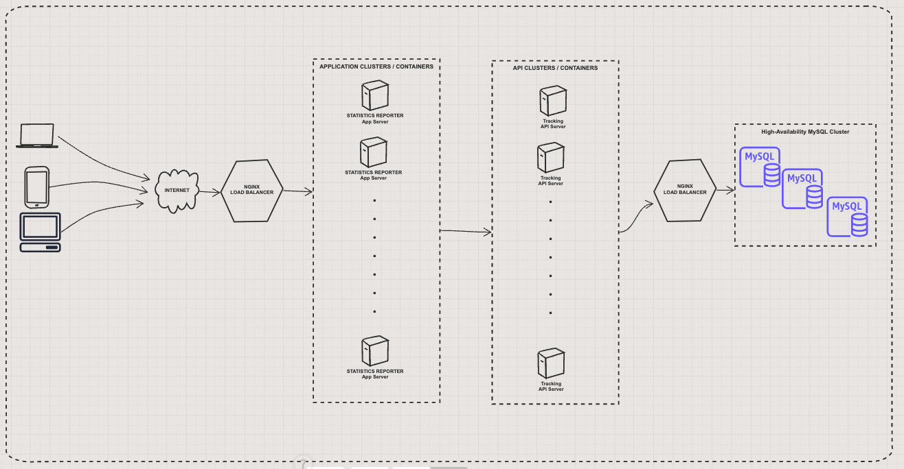

# Tracking API

It is a tracker API with 2 endpoints. It accepts HTTP request and identifies unique users who have clicked the http://localhost:3000 url.

The structure of the project:

- `Route` configuration is done to define the requests our API can handle
    
- `Service` for tasks such as connecting to our database models, doing queries is done. They can be connected to external services that are required by the specific request if needed.
    
- `Middleware` is added for running specific request validations before the final controller of a route handles its specifics.
    
- `Model` is added for defining visitor to facilitate data storage and retrieval.
    
- `Controller` is created for separating the route configuration from the code that finally (after any middleware) processes a route request, calls the above service functions if necessary, and gives a response to the client.


I have also implemented [reporter app](https://github.com/RaminMammadzada/tracking-report-app) with Angular, which you can see the statistics of visitor in user interface and can download it as a CSV file on demand. To test it out, you should up and run this API project firstly.

### Current Architechture of the application


### Architechtural sketch of possible entire application with highly available API design



### Built with the following tech stack

- Typescript
- NodeJS v14.18.x
- npm v6.14.x
- ESlint
- ES6+ module system is used.
- Mocha, Chai for unit testing.
- Sequelize ORM
- MySQL

### Prerequisites
You will need to have the following tech stack installed in your local environment.

- MySQL Ver 8.0.28
- NodeJS v14.18.x
- npm v6.14.x
- Typescript


### Setup

Clone the repo by typing

```
git clone https://github.com/RaminMammadzada/tracking-api.git
```

Cd indo the project

```
cd tracking-api
```

Install packages with

```
  npm install
```

Create .env file in the root of the project with and fill in with the following information:

```
    DB_NAME='tracking_api_dev'
    DB_USER='your_mysql_username'
    DB_HOST='localhost'
    DB_DRIVER='mysql'
    DB_PASSWORD='your_mysql_password'
```

Create database with Sequelize-cli command

```
  npx sequelize-cli db:create
```

Migrate models with Sequelize-cli command

```
  npx sequelize-cli db:migrate
```

If all is set, you will have a database with the name `tracking_api_dev` created and 1 table called Visitors inside it.

Start server with:

```
  npm run start
```

For development you can use the following script:

```
  npm run dev
```

It will start running in PORT 3000.
You can test the following endpoints in http://localhost:3000 url:


The REST endpoints
```
/GET http://localhost:3000/
/GET http://localhost:3000/visitors
```

### Unit tests

RUn the following command to run the unit tests:

```
npm run test
```

### Running with dockerfile

It is in TODO stage now.
It has a bug, which is needed to be fixed.
For the sake of time, I skipped it.

## Author

👤 **Ramin Mammadzada**

- Github: [@raminmammadzada](https://github.com/raminmammadzada)
- Twitter: [@raminmammadzada](https://twitter.com/raminmammadzada)
- Linkedin: [Ramin Mammadzada](https://www.linkedin.com/in/raminmammadzada/)

### Contributing

Contributions, issues, and feature requests are welcome!

Feel free to check the [issues page](https://github.com/RaminMammadzada/tracking-api/issues)

### Show your support

Give a star if you like this project!
